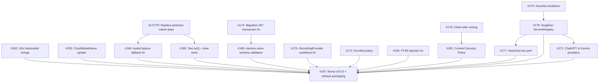

# VoiceVault — Issue Execution Plan

**Generated:** 2026-03-05
**Open Issues:** 17
**Milestone:** v0.5.0 (Electron Desktop App)

---

## Section A: Dependency Graph (Mermaid)



---

## Section B: Execution Order Table

### Issue Inventory (extracted from GitHub)

| # | Title | Phase | Priority | Est. | Dependencies | Area |
|---|-------|-------|----------|------|-------------|------|
| 172 | Replace phantom native deps | A | **P0** | 3d | none | backend |
| 173 | ErrorBoundary components | A | P1 | 0.5d | none | frontend |
| 174 | Migration 007 transaction fix | A | P1 | 0.5d | none | database |
| 175 | Graceful shutdown | A | P1 | 1d | none | backend |
| 176 | RecordingProvider useMemo fix | A | P1 | 0.5d | none | frontend, perf |
| 177 | VectorService perf | B | P1 | 2d | #178 | rag, perf |
| 178 | Singleton ServiceRegistry | B | P1 | 2d | #175 | backend |
| 179 | Client-side routing | B | P1 | 1.5d | none | frontend |
| 180 | FTS5 injection fix | B | P1 | 0.5d | none | database, security |
| 181 | Content Security Policy | B | P1 | 1d | #179 (implicit: CSP must account for router) | frontend, security |
| 182 | i18n hardcoded strings | C | P1 | 0.5d | none | frontend |
| 183 | CloudModelName update | C | P1 | 0.5d | none | backend |
| 184 | AudioCapture fallback fix | C | P1 | 1d | #172 | backend |
| 185 | Test act() + slow timer | C | P2 | 0.5d | #172 (tests depend on real service stubs) | test |
| 186 | electron-store schema validation | C | P1 | 1d | #174 (migration patterns must be stable) | backend |
| 187 | Bump v0.5.0 + release packaging | C | P1 | 1d | ALL others | release |
| 171 | ChatGPT & Gemini providers | — | P2 | 2d | #178 (needs service registry for provider DI) | enhancement |

### Execution Batches

| Order | Batch | Issue # | Title | Priority | Est. | Dependencies | Parallelizable With |
|-------|-------|---------|-------|----------|------|--------------|---------------------|
| 1 | **A** | **#172** | Replace phantom native deps | **P0** | 3d | none | #173, #174, #175, #176, #179, #180, #182, #183 |
| 2 | **A** | #175 | Graceful shutdown | P1 | 1d | none | #172, #173, #174, #176, #179, #180, #182, #183 |
| 3 | **A** | #174 | Migration 007 transaction fix | P1 | 0.5d | none | #172, #173, #175, #176, #179, #180, #182, #183 |
| 4 | **A** | #173 | ErrorBoundary components | P1 | 0.5d | none | #172, #174, #175, #176, #179, #180, #182, #183 |
| 5 | **A** | #176 | RecordingProvider useMemo fix | P1 | 0.5d | none | #172, #173, #174, #175, #179, #180, #182, #183 |
| 6 | **A** | #179 | Client-side routing | P1 | 1.5d | none | #172, #173, #174, #175, #176, #180, #182, #183 |
| 7 | **A** | #180 | FTS5 injection fix | P1 | 0.5d | none | #172, #173, #174, #175, #176, #179, #182, #183 |
| 8 | **A** | #182 | i18n hardcoded strings | P1 | 0.5d | none | #172, #173, #174, #175, #176, #179, #180, #183 |
| 9 | **A** | #183 | CloudModelName update | P1 | 0.5d | none | #172, #173, #174, #175, #176, #179, #180, #182 |
| 10 | **B** | #178 | Singleton ServiceRegistry | P1 | 2d | #175 | #181, #184, #185, #186 |
| 11 | **B** | #181 | Content Security Policy | P1 | 1d | #179 | #178, #184, #185, #186 |
| 12 | **B** | #184 | AudioCapture fallback fix | P1 | 1d | #172 | #178, #181, #185, #186 |
| 13 | **B** | #185 | Test act() + slow timer | P2 | 0.5d | #172 | #178, #181, #184, #186 |
| 14 | **B** | #186 | electron-store schema validation | P1 | 1d | #174 | #178, #181, #184, #185 |
| 15 | **C** | #177 | VectorService perf | P1 | 2d | #178 | #171 |
| 16 | **C** | #171 | ChatGPT & Gemini providers | P2 | 2d | #178 | #177 |
| 17 | **D** | #187 | Bump v0.5.0 + release packaging | P1 | 1d | ALL | — |

---

## Section C: Critical Path

The longest dependency chain from start to finish:

```
#175 (1d) → #178 (2d) → #177 (2d) → #187 (1d) = 6d
```

Alternative critical chain (through P0):
```
#172 (3d) → #184 (1d) → #187 (1d) = 5d
```

**The critical path is: #175 → #178 → #177 → #187 = 6 days**

### Duration Estimates

| Scenario | Duration |
|----------|----------|
| **Minimum (unlimited parallelism)** | **6 days** (critical path above) |
| **Serial (single-threaded)** | **19.5 days** (sum of all estimates) |
| **Realistic (2 parallel streams)** | **~10 days** |

### Recommended Parallel Streams

**Stream 1 (Backend/Services):** #172 → #184 → #175 → #178 → #177 → #171
**Stream 2 (Frontend/DB/Polish):** #174 + #176 + #173 + #180 + #182 + #183 → #179 → #181 → #186 → #185
**Final:** #187 (after both streams converge)

---

## Notes

1. **#172 is the only P0** — phantom native deps block real audio/transcription. Everything else is P1/P2.
2. **#182 is partially done** — our recent commits addressed some i18n strings. Needs audit to close.
3. **#178 (ServiceRegistry) is the biggest bottleneck** — it blocks #177 (vector perf) and #171 (new LLM providers). Prioritize after #175.
4. **#187 (release) is the terminal node** — it depends on everything. Don't start until all others merge.
5. **#171 (ChatGPT/Gemini) is nice-to-have** for v0.5.0. Can defer to v0.6.0 if timeline is tight.
