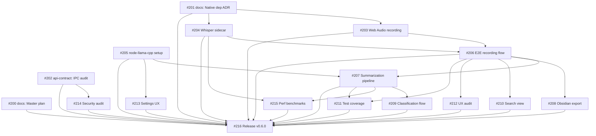

# VoiceVault — v0.6.0 Issue Execution Plan

**Generated:** 2026-03-05
**Open Issues:** 16
**Milestone:** v0.6.0 - Make It Real

---

## Section A: Dependency Graph (Mermaid)



---

## Section B: Execution Order Table

### Issue Inventory

| # | Title | Phase | Priority | Est. | Tasks | DoD | Dependencies | Area |
|---|-------|-------|----------|------|-------|-----|-------------|------|
| 200 | docs: Master plan, scope definition, context pack | 0 | P1 | 2d | 6 | 3 | none | docs |
| 201 | docs: Native dependency strategy ADR | 0 | P0¹ | 2d | 6 | 3 | none | docs, plugin-core |
| 202 | api-contract: IPC channel audit | 0 | P1 | 1d | 6 | 4 | none | api-contract |
| 203 | plugin-core: Web Audio API recording | 1 | P0¹ | 3d | 7 | 4 | #201 | plugin-core |
| 204 | plugin-core: Whisper sidecar/whisper-node | 1 | P0¹ | 3d | 7 | 4 | #201 | plugin-core |
| 205 | plugin-core: node-llama-cpp model download + UI | 1 | P1 | 2d | 7 | 4 | none | plugin-core, frontend |
| 206 | frontend: E2E recording flow | 2 | P0¹ | 3d | 7 | 3 | #203, #204 | frontend |
| 207 | plugin-core: Summarization pipeline | 2 | P1 | 2d | 7 | 4 | #206, #205 | plugin-core, frontend |
| 208 | vault-integration: Obsidian export | 2 | P1 | 2d | 8 | 3 | #206 | vault-integration |
| 209 | frontend: Classification flow | 2 | P1 | 2d | 6 | 4 | #207 | frontend, plugin-core |
| 210 | frontend: Search view graceful degradation | 2 | P1 | 2d | 7 | 3 | #206 | frontend |
| 211 | test: Unit + E2E coverage | 3 | P1 | 3d | 9 | 3 | #206, #207 | test |
| 212 | frontend: UX audit (empty states, i18n) | 3 | P1 | 2d | 8 | 3 | #206 | frontend |
| 213 | frontend: Settings UX | 3 | P1 | 2d | 8 | 3 | #205 | frontend |
| 214 | security: IPC validation, CSP, permissions | 3 | P1 | 2d | 7 | 4 | #202 | security |
| 215 | performance: Whisper + LLM benchmarks | 3 | P2 | 1d | 6 | 3 | #204, #207 | performance |
| 216 | release: v0.6.0 bump + packaging | 3 | P1 | 1d | 9 | 4 | ALL | release |

> ¹ P0 inferred: #201 is the single blocker for both #203 and #204; #203 + #204 block #206; #206 is the hub that unlocks 6 downstream issues. These form the critical path — all are effectively P0.

### Execution Batches

| Order | Batch | Issue # | Title | Priority | Est. | Dependencies | Parallelizable With |
|-------|-------|---------|-------|----------|------|--------------|---------------------|
| 1 | **A** | **#201** | docs: Native dependency strategy ADR | **P0** | 2d | none | #200, #202, #205 |
| 2 | **A** | #200 | docs: Master plan, scope, context pack | P1 | 2d | none | #201, #202, #205 |
| 3 | **A** | #202 | api-contract: IPC channel audit | P1 | 1d | none | #200, #201, #205 |
| 4 | **A** | #205 | plugin-core: node-llama-cpp model download + UI | P1 | 2d | none | #200, #201, #202 |
| 5 | **B** | **#203** | plugin-core: Web Audio API recording | **P0** | 3d | #201 | #204, #213, #214 |
| 6 | **B** | **#204** | plugin-core: Whisper sidecar / whisper-node | **P0** | 3d | #201 | #203, #213, #214 |
| 7 | **B** | #213 | frontend: Settings UX | P1 | 2d | #205 | #203, #204, #214 |
| 8 | **B** | #214 | security: IPC validation, CSP, permissions | P1 | 2d | #202 | #203, #204, #213 |
| 9 | **C** | **#206** | frontend: E2E recording flow | **P0** | 3d | #203, #204 | — |
| 10 | **D** | #207 | plugin-core: Summarization pipeline | P1 | 2d | #206, #205 | #208, #210, #212 |
| 11 | **D** | #208 | vault-integration: Obsidian export | P1 | 2d | #206 | #207, #210, #212 |
| 12 | **D** | #210 | frontend: Search view graceful degradation | P1 | 2d | #206 | #207, #208, #212 |
| 13 | **D** | #212 | frontend: UX audit (empty states, i18n) | P1 | 2d | #206 | #207, #208, #210 |
| 14 | **E** | #209 | frontend: Classification flow | P1 | 2d | #207 | #211, #215 |
| 15 | **E** | #211 | test: Unit + E2E coverage | P1 | 3d | #206, #207 | #209, #215 |
| 16 | **E** | #215 | performance: Whisper + LLM benchmarks | P2 | 1d | #204, #207 | #209, #211 |
| 17 | **F** | #216 | release: v0.6.0 bump + packaging | P1 | 1d | ALL | — |

---

## Section C: Critical Path

The longest dependency chain from start to finish:

```
#201 (2d) → #204 (3d) → #206 (3d) → #207 (2d) → #209 (2d) → #216 (1d) = 13d
```

Alternative critical chains:
```
#201 (2d) → #203 (3d) → #206 (3d) → #207 (2d) → #211 (3d) → #216 (1d) = 14d  ← LONGEST
#201 (2d) → #204 (3d) → #206 (3d) → #207 (2d) → #215 (1d) → #216 (1d) = 12d
```

**The critical path is: #201 → #203 → #206 → #207 → #211 → #216 = 14 days**

(#203 and #204 are equal-length at 3d, but #203 → #206 and #204 → #206 are both required. They run in parallel in Batch B, so the effective critical path through either is 3d.)

### Duration Estimates

| Scenario | Duration |
|----------|----------|
| **Minimum (unlimited parallelism)** | **14 days** (critical path above) |
| **Serial (single-threaded)** | **34 days** (sum of all estimates) |
| **Realistic (2 parallel streams)** | **~18–20 days** |
| **Realistic (3 parallel streams)** | **~15–17 days** |

### Recommended Parallel Streams

**Stream 1 (Critical Path — Core Pipeline):**
#201 → #203 → #206 → #207 → #209 → #216

**Stream 2 (Infrastructure + Quality):**
#202 → #214 ‖ #204 → #215 → #211

**Stream 3 (Frontend + Docs):**
#200 ‖ #205 → #213 ‖ #208 ‖ #210 ‖ #212

### Batch Timeline (4 weeks)

```
Week 1 (Batch A):  #200 + #201 + #202 + #205    [4 issues, all parallel]
Week 2 (Batch B):  #203 + #204 + #213 + #214    [4 issues, all parallel]
Week 3 (Batch C+D): #206 → #207 + #208 + #210 + #212  [hub then 4 parallel]
Week 4 (Batch E+F): #209 + #211 + #215 → #216  [3 parallel then release]
```

---

## Notes

1. **#201 (Native Dep ADR) is the true P0** — it's the entry point that unblocks both #203 and #204, which together unblock the entire pipeline. Fast-track this.
2. **#206 (E2E Recording) is the hub node** — it has 2 upstream deps and 6 downstream dependents. This is the milestone's bottleneck. Once it's done, work fans out massively.
3. **#205 (node-llama-cpp) has no deps** but is on the critical path to #207. Start it in Batch A alongside docs work to avoid blocking summarization.
4. **#214 (Security) and #213 (Settings UX)** are independent of the core pipeline — schedule them to fill gaps when engineers wait for Batch C.
5. **#215 (Perf benchmarks)** is P2 and can be deferred to last if timeline is tight. It only blocks #216.
6. **#216 (Release)** is the terminal node — depends on everything. Don't start until all 15 others merge.
7. **#200 (Master plan) is self-referential** — it creates the docs that other issues reference. Prioritize finishing it early in Week 1 so #201 can reference the scope definition.
