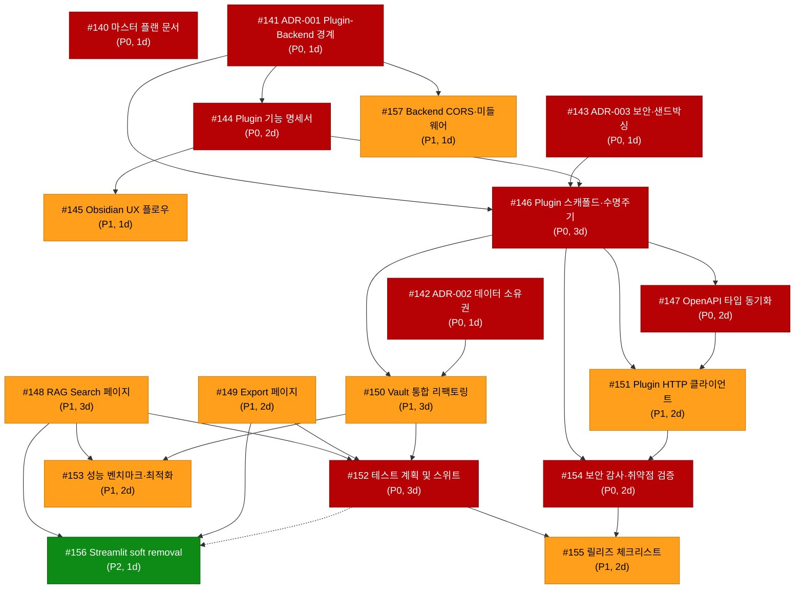

# v0.5.0 실행 순서 계획 (Execution Order)

> **생성 기준**: `v0.5.0 - Obsidian Vault Integration Refactor` 마일스톤 오픈 이슈 #140–#157 (총 18개)  
> **분석 방법**: 명시적 의존성 + 묵시적 의존성 DAG → 우선순위 규칙 적용 → 최적 실행 순서 도출  
> **작성일**: 2026-02-25

---

## Section A: 의존성 그래프 (Dependency Graph)



> **범례**: 실선 = 명시적 의존성, 점선 = 묵시적 의존성 (각주 참조)  
> **노드 색상**: 🔴 P0 (Must Have) · 🟠 P1 (Should Have) · 🟢 P2 (Nice to Have)

---

## Section B: 실행 순서 표

> **배치(Batch)**: 동시에 착수 가능한 이슈 그룹. 배치 내에서 P0 → P1 → P2 순 나열.  
> **달력 기준**: Batch A 시작 = Day 0, 무제한 병렬 실행 전제.

| 순번 | 배치 | 이슈 # | 제목 | 우선순위 | 예상 소요 | 의존성 | 동시 착수 가능 |
|------|------|--------|------|----------|-----------|--------|----------------|
| 1 | **A** | #140 | v0.5.0 마스터 플랜 문서 작성 | P0 | 1d | 없음 | #141, #142, #143 |
| 2 | **A** | #141 | ADR-001 플러그인-백엔드 경계 설계 | P0 | 1d | 없음 | #140, #142, #143 |
| 3 | **A** | #142 | ADR-002 데이터 소유권 결정 (Vault vs DB) | P0 | 1d | 없음 | #140, #141, #143 |
| 4 | **A** | #143 | ADR-003 보안 및 샌드박싱 정책 수립 | P0 | 1d | 없음 | #140, #141, #142 |
| 5 | **B** | #144 | 플러그인 기능 명세서 작성 (plugin-feature-spec) | P0 | 2d | #141 | #157, #148, #149 |
| 6 | **B** | #157 | Backend CORS 및 Plugin 호환 미들웨어 설정 | P1 | 1d | #141 | #144, #148, #149 |
| 7 | **B** | #148 | RAG Search 페이지 구현 (Next.js) | P1 | 3d | 없음¹ | #144, #157, #149 |
| 8 | **B** | #149 | Export 페이지 구현 — Obsidian Markdown (Next.js) | P1 | 2d | 없음¹ | #144, #157, #148 |
| 9 | **C** | #146 | Obsidian 플러그인 스캐폴드 및 수명주기 관리 | P0 | 3d | #141, #143, #144² | #145 |
| 10 | **C** | #145 | Obsidian UX 플로우 설계 | P1 | 1d | #144 | #146 |
| 11 | **D** | #147 | Plugin-Backend OpenAPI 타입 동기화 파이프라인 | P0 | 2d | #146 | #150 |
| 12 | **D** | #150 | Obsidian Vault 통합 리팩토링 | P1 | 3d | #142, #146 | #147 |
| 13 | **E** | #151 | 플러그인 HTTP 클라이언트 및 에러 핸들링 구현 | P1 | 2d | #146, #147 | — |
| 14 | **F** | #152 | v0.5.0 테스트 계획 수립 및 테스트 스위트 구축 | P0 | 3d | #148, #149, #150 | #153 |
| 15 | **F** | #153 | 성능 벤치마크 및 최적화 | P1 | 2d | #148, #150 | #152 |
| 16 | **G** | #154 | 보안 감사 및 취약점 검증 | P0 | 2d | #146, #151 | — |
| 17 | **H** | #155 | v0.5.0 릴리즈 체크리스트 작성 및 검증 | P1 | 2d | #152, #154 | #156 |
| 18 | **H** | #156 | Streamlit soft removal (경고 추가 및 문서 갱신) | P2 | 1d | #148, #149, #152³ | #155 |

### 배치별 착수 시점 요약

| 배치 | 착수 가능 시점 | 포함 이슈 | 배치 내 최장 소요 |
|------|--------------|----------|------------------|
| A | Day 0 | #140, #141, #142, #143 | 1d |
| B | Day 1 (Batch A 완료 후) | #144, #157, #148, #149 | 3d |
| C | Day 3 (B/#144 완료 후) | #146, #145 | 3d |
| D | Day 6 (C/#146 완료 후) | #147, #150 | 3d |
| E | Day 8 (D/#147 완료 후) | #151 | 2d |
| F | Day 9 (D/#150 완료 후) | #152, #153 | 3d |
| G | Day 10 (E/#151 완료 후) | #154 | 2d |
| H | Day 12 (F/#152 + G/#154 완료 후) | #155, #156 | 2d |

---

## Section C: 크리티컬 패스 (Critical Path)

### 메인 크리티컬 패스

```
#141 (1d) → #144 (2d) → #146 (3d) → #150 (3d) → #152 (3d) → #155 (2d)
```

**총 소요: 14일** (직렬 합산: 1+2+3+3+3+2 = **14d**)

| 단계 | 이슈 | 제목 | 소요 | 누적 시점 |
|------|------|------|------|-----------|
| 1 | #141 | ADR-001 플러그인-백엔드 경계 설계 | 1d | Day 0→1 |
| 2 | #144 | 플러그인 기능 명세서 작성 | 2d | Day 1→3 |
| 3 | #146 | Obsidian 플러그인 스캐폴드 및 수명주기 관리 | 3d | Day 3→6 |
| 4 | #150 | Obsidian Vault 통합 리팩토링 | 3d | Day 6→9 |
| 5 | #152 | v0.5.0 테스트 계획 수립 및 테스트 스위트 구축 | 3d | Day 9→12 |
| 6 | #155 | v0.5.0 릴리즈 체크리스트 작성 및 검증 | 2d | Day 12→14 |

> **동률 패스**: `#141 → #144 → #146 → #147 → #151 → #154 → #155` 역시 총 **14d** (1+2+3+2+2+2+2).  
> 두 패스 모두 #155에서 합류하며, 어느 한 쪽이 지연되면 릴리즈가 지연됨.

---

### 병렬 실행 vs 직렬 실행 비교

| 구분 | 기간 | 조건 |
|------|------|------|
| **최소 달력 기간** (무제한 병렬) | **14일** | 위 크리티컬 패스 준수, 모든 배치를 즉시 병렬 착수 |
| **최대 직렬 기간** (단일 스레드) | **33일** | 이슈를 1개씩 순차 처리 (전체 합산: 18개 이슈 × 평균 약 1.8일) |
| **실용적 추정** (2명 병렬) | **~18–20일** | Batch A/B는 2인이 나눠 처리, Phase 3는 순차 |

---

### 크리티컬 패스상 블로커 분석

| 이슈 | 블로킹 대상 (직·간접) | 지연 시 영향 |
|------|----------------------|------------|
| **#141** ADR-001 | #144, #146, #157 → 하위 전체 | 전체 일정 +n일 지연 |
| **#144** Plugin 기능 명세서 | #145, #146 → 구현 전체 | Batch C 지연 → #150 → #152 → #155 |
| **#146** Plugin 스캐폴드 | #147, #150, #151, #154 | Batch D~H 전체 지연 |
| **#150** Vault 통합 리팩토링 | #152 → #155 | 테스트 및 릴리즈 지연 |
| **#152** 테스트 계획·스위트 | #155, #156 | 릴리즈 차단 |

---

## 각주 (Footnotes)

> **¹ #148, #149 — 명시적 의존성 없음에 대한 추론**  
> 두 이슈 모두 "의존성: 없음 (기존 Backend RAG/Export API 활용)"이라고 명시되어 있습니다.  
> 그러나 Phase 2 구현 이슈이므로, Phase 0 문서(ADR-001~003, plugin-feature-spec)가 확정된 후 착수하는 것이 실무적으로 바람직합니다.  
> 따라서 Batch B(Phase 0 완료 직후)에 배치하는 소프트 순서 제약을 적용했습니다.  
> 기술적으로는 Day 0부터 착수 가능하나, 문서 없이 구현 방향이 흔들릴 위험이 있습니다.

> **² #146 — plugin-feature-spec(#144) 묵시적 의존성 추가 이유**  
> #146의 명시적 의존성은 ADR-001(#141)과 ADR-003(#143)뿐입니다.  
> 그러나 Plugin 스캐폴드 구현 시 "어떤 기능을 노출할 것인가"를 알아야 SettingTab, Ribbon icon, Command palette 등록 항목이 확정됩니다.  
> plugin-feature-spec(#144)은 이 결정의 기준이 되는 명세서이므로, 묵시적 선행 조건으로 판단했습니다.  
> Rule 4(Docs before implementation) 및 Phase 순서 소프트 제약과도 일치합니다.

> **³ #156 — 테스트 계획(#152) 묵시적 의존성 추가 이유**  
> #156의 명시적 의존성은 "RAG Search 페이지(#148), Export 페이지(#149)"이지만, 이슈 본문에 **"Next.js 기능 패리티 확인 후 진행"** 이라고 명시되어 있습니다.  
> "기능 패리티 확인"은 테스트를 통해 검증되는 사항이며, 이는 #152(테스트 계획 및 스위트 구축)의 산출물입니다.  
> 따라서 #152 완료 후 착수하는 것이 논리적입니다. Phase 3 소프트 제약과도 동일하게 Batch H 배치를 지지합니다.

---

*이 문서는 `docs/milestones/v0.5.0/README.md`의 §3 필수 산출물 목록에는 없으나,  
`v0.5.0-master-plan.md` 작성(#140)의 선행 입력 자료로 활용될 수 있습니다.*
