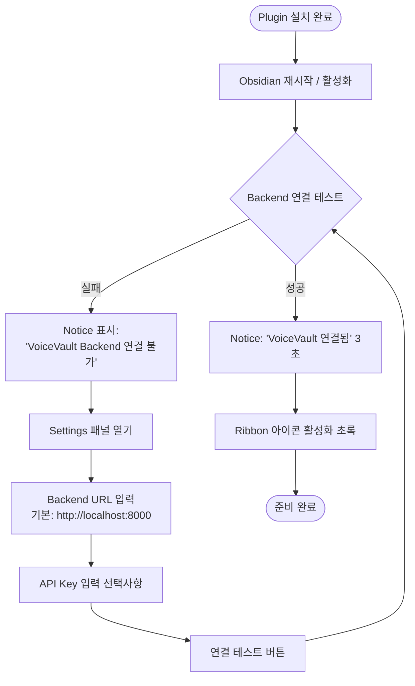
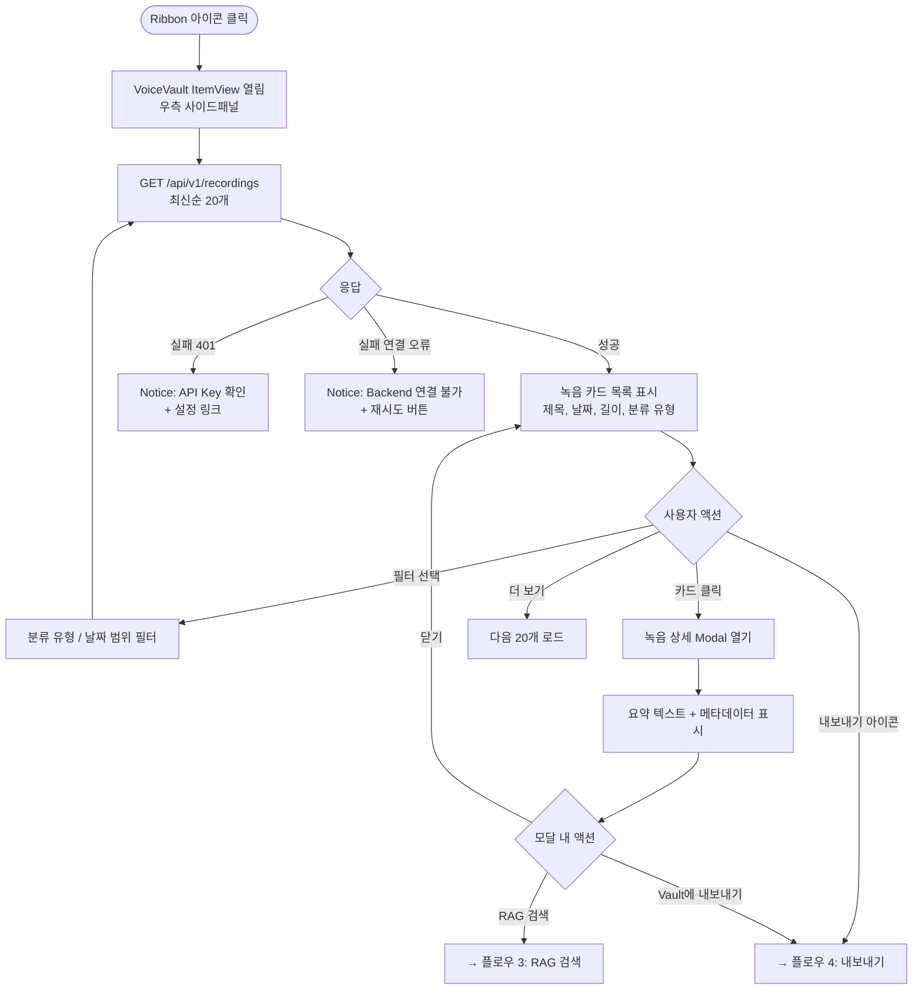
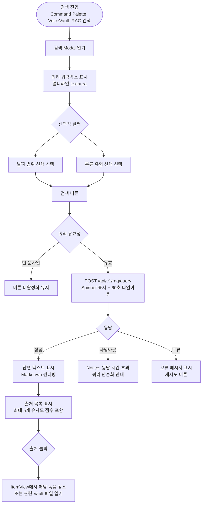
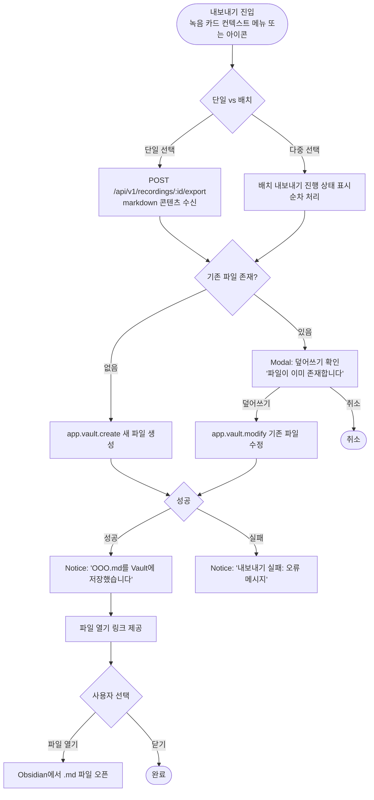
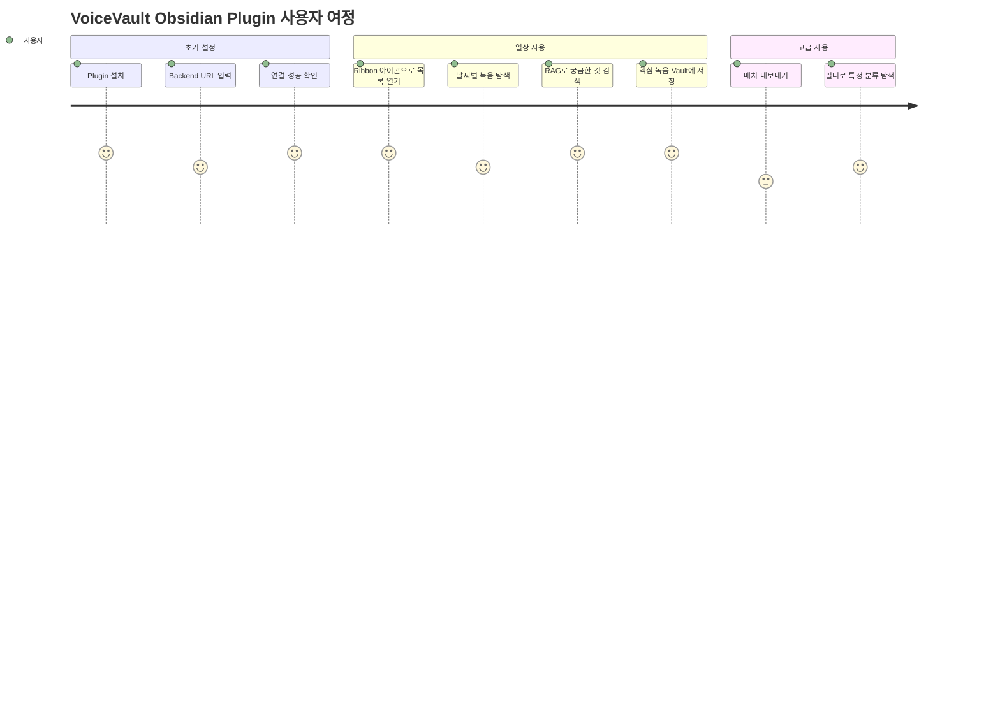

# Obsidian UX 플로우 설계

> **관련 이슈**: [#145](https://github.com/PJH720/VoiceVault/issues/145)  
> **의존**: plugin-feature-spec.md (#144)  
> **작성일**: 2026-02-25  
> **상태**: ✅ Accepted

---

## 개요

VoiceVault Obsidian Plugin의 전체 사용자 경험 흐름을 시각화합니다.  
핵심 4가지 플로우: **초기 설정 → 녹음 목록 조회 → RAG 검색 → Markdown 내보내기**

---

## 플로우 1: 최초 설정

**Obsidian UI 패턴 매핑**:
- `SettingTab` — Backend URL, API Key, 내보내기 폴더 설정
- `Notice` — 연결 성공/실패 피드백
- Ribbon icon 색상: 연결됨(초록) / 미연결(회색)

---

## 플로우 2: 녹음 목록 조회

**Obsidian UI 패턴 매핑**:
- `ItemView` — 우측 사이드패널 (Leaf 기반)
- `Modal` — 녹음 상세 표시
- `createEl()` — 카드 DOM 구성 (innerHTML 금지)

---

## 플로우 3: RAG 자연어 검색

**Obsidian UI 패턴 매핑**:
- `Modal` — 검색 입력 및 결과 표시
- `MarkdownRenderer.renderMarkdown()` — 답변 텍스트 렌더링
- `Command` (Command Palette) — `this.addCommand()` 등록

---

## 플로우 4: Obsidian Markdown 내보내기

**Obsidian UI 패턴 매핑**:
- `app.vault.create()` / `app.vault.modify()` — Vault 파일 쓰기
- `normalizePath()` — 경로 정규화 (ADR-003 §2.2)
- `Modal` — 덮어쓰기 확인 다이얼로그
- `Notice` — 성공/실패 피드백

---

## 전체 사용자 여정 요약

---

## Obsidian 네이티브 진입점 매핑

| 진입점 | 구현 방법 | 연결 플로우 |
|--------|-----------|------------|
| Ribbon 아이콘 (마이크) | `this.addRibbonIcon('microphone', ...)` | 플로우 2: 녹음 목록 |
| Command Palette | `this.addCommand({ id: 'rag-search', ... })` | 플로우 3: RAG 검색 |
| 파일 컨텍스트 메뉴 | `this.registerEvent(app.workspace.on('file-menu', ...))` | 플로우 4: 내보내기 |
| 설정 탭 | `this.addSettingTab(new VoiceVaultSettingTab(...))` | 플로우 1: 설정 |
| Status Bar | `this.addStatusBarItem()` | Backend 연결 상태 표시 |

---

## plugin-feature-spec과 일관성 확인

- [x] Feature 1 (녹음 목록 조회): 플로우 2 커버
- [x] Feature 2 (RAG 검색): 플로우 3 커버
- [x] Feature 3 (Markdown 내보내기): 플로우 4 커버
- [x] Health Check 흐름: 플로우 1에 통합
- [x] 오프라인 동작: 각 플로우의 실패 분기에 표현
- [x] ADR-003 보안 규칙: `normalizePath`, `createEl`, `app.vault.create` 명시

---

*Closes #145*
